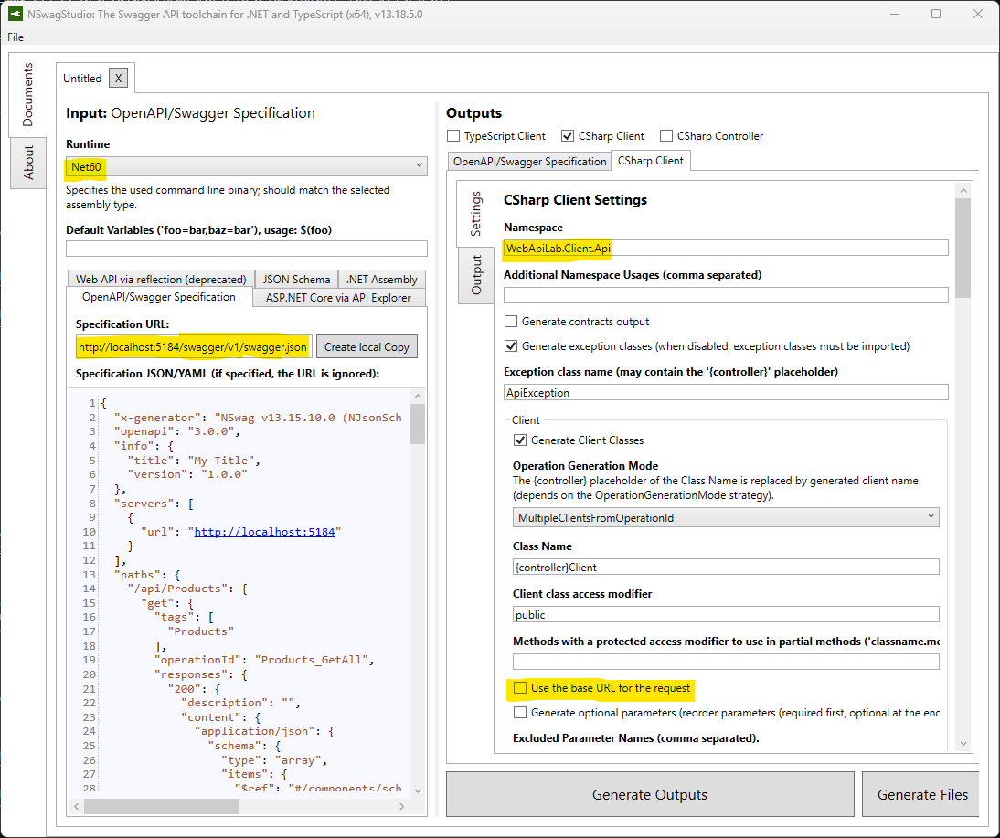
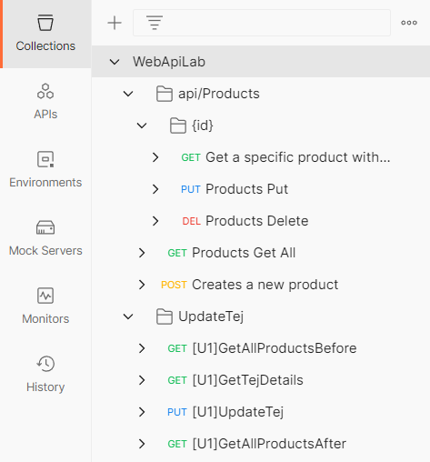
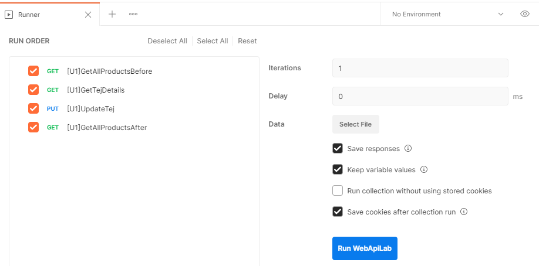
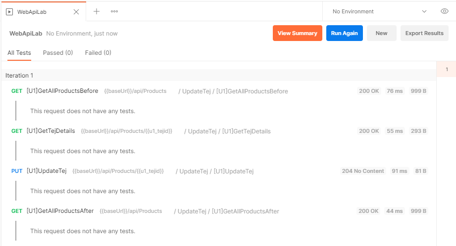
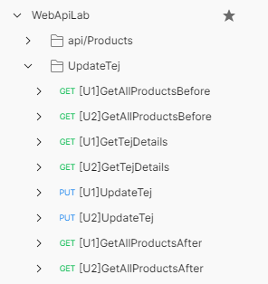
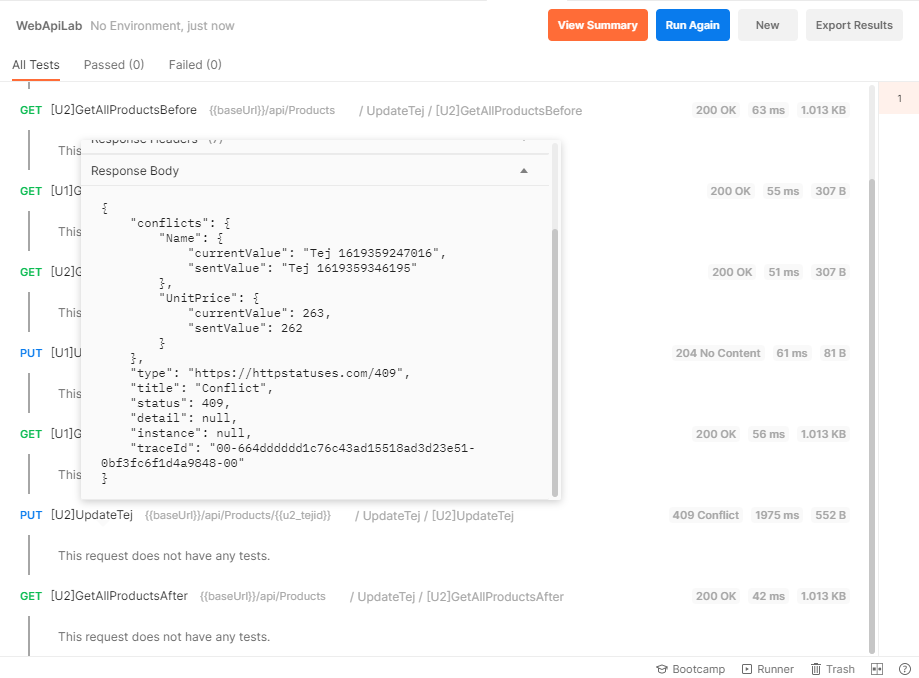

# ASP.NET Core webszolgáltatások III.

# Kiegészítő anyagok, segédeszközök

- kapcsolódó repo: <https://github.com/bmeviauav23/WebApiLab-kiindulo>
- [NSwag Studio](https://github.com/RicoSuter/NSwag/wiki/NSwagStudio) - itt is elég csak a [legfrissebb zip verziót](https://github.com/RicoSuter/NSwag/releases/latest) az **Assets** részről letölteni
- [Postman](https://www.getpostman.com/) HTTP kérések küldéséhez

## Kiinduló projektek beüzemelése

Klónozzuk le a kiinduló projekt `lab-kiindulo-240502` ágát, ez az előző gyakorlat folytatása - a kódot ismerjük. Ha nincs már meg az adatbázisunk, akkor az előző gyakorlat alapján hozzuk létre az adatbázist Code-First migrációval (`Update-Database`).

```cmd
git clone https://github.com/bmeviauav23/WebApiLab-kiindulo -b lab-kiindulo-240502
```

## Egyszerű kliens

A tárgy tematikájának ugyan nem része a kliensoldal, de demonstrációs céllal egy egyszerű kliensoldalról indított hívást implementálunk.
A webes API-khoz nagyon sokféle technikával írhatunk klienst, mivel gyakorlatilag csak két képességgel kell rendelkezni:

- HTTP alapú kommunikáció, HTTP kérések küldése, a válasz feldolgozása
- JSON sorosítás

A fentiekhez szinte minden manapság használt kliensoldali technológia ad támogatást. Mi most egy sima, .NET alapú konzol alkalmazást írunk kliens gyanánt.

A két képességet könnyen lefedhetjük a **System.Net.Http** (HTTP kommunikáció) és a **System.Text.Json** (JSON sorosítás) csomagokkal.
Mindkettő a **Microsoft.NetCore.App** shared framework része, így általában nem kell külön beszereznünk őket.

Adjunk a solution-höz egy konzolos projektet (Console App (.NET 8), **nem .NET Framework!**) *WebApiLab.Client* néven.
A *Program.cs*-ben írjuk meg az egy terméket lekérdező függvényt (`GetProductAsync`) és hívjuk meg.

``` csharp
Console.Write("ProductId: ");
var id = Console.ReadLine();
if(id != null)
{
    await GetProductAsync(int.Parse(id));
}

Console.ReadKey();

static async Task GetProductAsync(int id)
{
    using var client = new HttpClient();

    // Ha eltér, a portot írjuk át a szervernek megfelelően
    var response = await client.GetAsync(new Uri($"http://localhost:5184/api/Products/{id}"));
    response.EnsureSuccessStatusCode();
    var jsonStream = await response.Content.ReadAsStreamAsync();
    var json = await JsonDocument.ParseAsync(jsonStream);
    Console.WriteLine(
        $"{json.RootElement.GetProperty("name")}:" +
        $"{json.RootElement.GetProperty("unitPrice")}");
}
```

Ez most jelenleg csak egy egyszerű példa DTO osztályok nélkül, a későbbiekben egyszerűsíteni fogjuk a JSON feldolgozást.

!!! tip .NET 8 kliensen is
    Az elterjedtebb .NET alapú kliensek, a WinForms, WPF alkalmazások a legutóbbi időkig .NET Framework alapúak voltak, viszont már egy ideje a .NET 6-os verziótól felfelé is támogatja a WinForms, WPF, WinUI, MAUI (régi Xamarin) alkalmazásokat. Célszerű ezeket választani a régi .NET Framework alapú változatok helyett.

Állítsuk be, hogy a szerver és a kliensoldal is elinduljon (menu:solutionön jobbklikk\[Set startup projects…\]), majd próbáljuk ki, hogy a megadott azonosítójú termék neve és ára megjelenik-e a konzolon.

Jelenleg csak alapszintű (nem típusos) JSON sorosítást alkalmazunk.
A következő lépés az lenne, hogy a JSON alapján visszasorosítanánk egy konkrétabb objektumba.
Ehhez kliensoldalon is kellene lennie egy `Product` DTO-nak megfelelő osztálynak.
Hogyan jöhetnek létre a kliensoldali modellosztályok?

- kézzel létrehozzuk őket a JSON alapján - macerás, bár vannak rá [eszközök](https://www.meziantou.net/visual-studio-tips-and-tricks-paste-as-json.htm), amik segítenek
- a DTO-kat osztálykönyvtárba szervezzük és mindkét alkalmazás hivatkozza 
    - csak akkor működik, ha mindkét oldal .NET-es, ráadásul könnyen kaphat az osztálykönyvtár olyan függőséget, ami igazából az egyik oldalnak kell csak, így meg mindkét oldal meg fogja kapni
- generáltatjuk valamilyen eszközzel a szerveroldal alapján - ezt próbáljuk most ki

Állítsuk be, hogy csak a szerveroldal (*Api* projekt) induljon.

## OpenAPI/Swagger Szerver oldal

Az *OpenAPI* (eredeti nevén: *Swagger*) eszközkészlet segítségével egy JSON alapú leírását tudjuk előállítani a szerveroldali API-nknak.
A leírás alapján generálhatunk dokumentációt, sőt kliensoldali kódot is a kliensoldali fejlesztők számára.
Jelenleg a legfrissebb specifikáció az OpenAPI v3-as (OAS v3).
Az egyes verziók dokumentációja elérhető [itt](https://github.com/OAI/OpenAPI-Specification/tree/master/versions).

Az OpenAPI nem .NET specifikus, különféle nyelven írt szervert és klienst is támogat.
Ugyanakkor készültek kifejezetten a .NET-hez is OpenAPI eszközök, ezek közül használunk párat most.
.NET környezetben a legelterjedtebb eszközkészletek:

- [NSwag](https://github.com/RicoSuter/NSwag) - leíró-, szerver-, és kliensoldali generálás is. Részleges OAS v3 támogatás.
- [Swashbuckle](https://github.com/domaindrivendev/Swashbuckle.AspNetCore) - csak leíró generálás. OAS v3 támogatott.
- [AutoRest](https://github.com/Azure/autorest) - *npm* csomag .NET függőséggel, csak kliensoldali kódgeneráláshoz. Részleges OAS v3 támogatás.
- [Swagger codegen](https://github.com/swagger-api/swagger-codegen) - java alapú kliensoldali generátor. C# támogatás [csak OpenAPI v2-höz](https://github.com/swagger-api/swagger-codegen-generators/issues/172)
- [Kiota](https://learn.microsoft.com/en-us/openapi/kiota) - új, Microsoft fejlesztésű C# alapú kliensoldali generátor. OAS v3 támogatott.

### Leíró generálás

Első lépésként a szerveroldali kódunk alapján Swagger leírást generálunk *NSwag* segítségével.

Adjuk hozzá a projekthez az **NSwag.AspNetCore** csomagot a `Package Manager Console`-ból vagy az API projekt Manage NuGet packages UI-on, és töröljük ki a **Swashbuckle.AspNetCore** csomagot.

Konfiguráljuk a szükséges szolgáltatásokat a DI rendszerbe.

``` csharp
//builder.Services.AddEndpointsApiExplorer();
//builder.Services.AddSwaggerGen();
builder.Services.AddOpenApiDocument();
```

Az OpenAPI leíró, illetve a dokumentációs felület kiszolgálására regisztráljunk egy-egy NSwag middleware-t az **Endpoint MW elé**. Az eddigi Swagger támogatással kapcsolatos kódok törölhetők.

``` csharp hl_lines="3-6"
if (app.Environment.IsDevelopment())
{
    //app.UseSwagger();
    //app.UseSwaggerUI();
    app.UseOpenApi();
    app.UseSwaggerUi();
}
```

A Swagger UI a `/swagger` útvonalon lesz elérhető.
Próbáljuk ki, hogy működik-e a dokumentációs felület a **/swagger** útvonalon, illetve a leíró elérhető-e a **/swagger/v1/swagger.json** útvonalon.

!!! tip
    A Swagger leíró linkje megtalálható a dokumentációs felület címsora alatt.

### Testreszabás - XML kommentek

Az NSwag képes a kódunk [XML kommentjeit](https://docs.microsoft.com/en-us/dotnet/csharp/codedoc) hasznosítani a dokumentációs felületen. Írjuk meg egy művelet XML kommentjét.

``` csharp hl_lines="1-6"
/// <summary>
/// Get a specific product with the given identifier
/// </summary>
/// <param name="id">Product's identifier</param>
/// <returns>Returns a specific product with the given identifier</returns>
/// <response code="200">Listing successful</response>
[HttpGet("{id}")]
public async Task<ActionResult<Product>> Get(int id){/*...*/}
```

A Swagger komponensünk az XML kommenteket nem a forráskódból, hanem egy generált állományból képes kiolvasni.
Állítsuk be ennek a generálását a projekt build beállításai között ( menu:Build\[XML documentation file\]).
Az alatta lévő textbox-ot üresen hagyhatjuk.

<figure markdown>

<figcaption>Projektbeállítások (Build lap) - XML dokumentációs fájl generálása</figcaption>
</figure>

### Testreszabás - Felsorolt típusok sorosítása szövegként

Következő kis testreszabási lehetőség, amit kipróbálunk, a felsorolt típusok szövegként való generálása (az egész számos kódolás helyett). Ez általában a bevált módszer, mivel a kliensek számára [kifejezőbb](https://softwareengineering.stackexchange.com/questions/220091/how-to-represent-enum-types-in-a-public-api). A DI-ban a JSON sorosítást konfiguráljuk:

``` csharp
builder.Services.AddControllers() //; törölve
    .AddJsonOptions(o =>
    {
        o.JsonSerializerOptions.Converters.Add(new JsonStringEnumConverter());
    });
```

Próbáljuk ki, hogy az XML kommentünk megjelenik-e a megfelelő műveletnél, illetve a válaszban a `Product.ShipmentRegion` szöveges értékeket vesz-e fel.

### Testreszabás - HTTP státuszkódok dokumentálása

Gyakori testreszabási feladat, hogy az egyes műveletek esetén a válasz pontos HTTP státuszkódját is dokumentálni szeretnénk, illetve ha több különböző kódú válasz is lehetséges, akkor mindegyiket.

Ehhez elég egy (vagy több) `ProducesResponseType` attribútumot felrakni a műveletre.

``` csharp hl_lines="6 8 13 18"
/// <summary>
/// Creates a new product
/// </summary>
/// <param name="product">The product to create</param>
/// <returns>Returns the product inserted</returns>
/// <response code="201">Insert successful</response>
[HttpPost]
[ProducesResponseType(StatusCodes.Status201Created)]
public async Task<ActionResult<Product>> Post([FromBody] Product product)
{/*...*/}

[HttpDelete("{id}")]
[ProducesResponseType(StatusCodes.Status204NoContent)]
public async Task<ActionResult> Delete(int id)
{/*...*/}
```

Ellenőrizzük, hogy a dokumentációs felületen a fentieknek megfelelő státuszkódok jelennek-e meg.

A hibaágakra is felvehetjük a megfelelő `ProducesResponseType` attribútumot, ahol annak generikus paramétere a hiba típusa.

``` csharp hl_lines="2 9-10 17-19 27-29 36-37"
[HttpGet]
[ProducesResponseType(StatusCodes.Status200OK)]
public async Task<ActionResult<IEnumerable<Product>>> Get()
{
    return await _productService.GetProductsAsync();
}

[HttpGet("{id}")]
[ProducesResponseType(StatusCodes.Status200OK)]
[ProducesResponseType<ProblemDetails>(StatusCodes.Status404NotFound)]
public async Task<ActionResult<Product>> Get(int id)
{
    return await _productService.GetProductAsync(id);
}

[HttpPost]
[ProducesResponseType(StatusCodes.Status201Created)]
[ProducesResponseType<ProblemDetails>(StatusCodes.Status404NotFound)]
[ProducesResponseType<ValidationProblemDetails>(StatusCodes.Status400BadRequest)]
public async Task<ActionResult<Product>> Post([FromBody] Product product)
{
    var created = await _productService.InsertProductAsync(product);
    return CreatedAtAction(nameof(Get), new { id = created.Id }, created);
}

[HttpPut("{id}")]
[ProducesResponseType(StatusCodes.Status200OK)]
[ProducesResponseType<ProblemDetails>(StatusCodes.Status404NotFound)]
[ProducesResponseType<ValidationProblemDetails>(StatusCodes.Status400BadRequest)]
public async Task<ActionResult<Product>> Put(int id, [FromBody] Product product)
{
    return await _productService.UpdateProductAsync(id, product);
}

[HttpDelete("{id}")]
[ProducesResponseType(StatusCodes.Status204NoContent)]
[ProducesResponseType<ProblemDetails>(StatusCodes.Status404NotFound)]
public async Task<ActionResult> Delete(int id)
{
    await _productService.DeleteProductAsync(id);
    return NoContent();
}
```

Vegyük észre az alábbiakat:

- Ha nem adunk meg a `ProducesResponseType` attribútumnak típus paramétert, akkor a metódus visszatérési értékéből próbálja kitalálni a modellt.
- Amíg nem adtunk meg semmilyen `ProducesResponseType` attribútumot, addig a Swagger UI az egyenes ágra mindig 200-as státuszkódot fog feltételezni
- Ezt a feltételezést elveszítjük, ha bármilyen `ProducesResponseType` attribútumot felvesszük pl.: `ProducesResponseType(StatusCodes.Status404NotFound)` esetében szükséges már kiírni a 200-as státuszkódot is, ha az is lehetséges válasz.
- A hibaeseteket akár közössé is tehetnénk, ha a `ProducesResponseType` attribútumokat nem a metódusra, hanem a kontrollerre raknánk. Ilyenkor viszont hibásan a listás végpontra is azt nyilatkoznánk, hogy jöhet 404-es státuszkód, pedig ez nem igaz.

## OpenAPI/Swagger kliensoldal

A kliensoldalt az *NSwag Studio* eszközzel generáltatjuk. Ez a generátor egy egyszerűen használható, de mégis sok beállítást támogató eszköz, azonban van pár hiányossága:

- egyetlen fájlt [generál](https://github.com/RicoSuter/NSwag/issues/1398)
- csak részlegesen támogatja az új JSON sorosítót, csak a [régebbit](https://github.com/RicoSuter/NSwag/issues/2243)

Előkészítésként adjuk a Client projekthez az alábbiakat:

- *Newtonsoft.Json* NuGet csomagot
- egy osztályt `ApiClients` néven

Indítsuk el a projektünket (a szerveroldalra lesz most szükség) és az NSwag Studio-t, és adjuk meg az alábbi beállításokat:

- Input rész (bal oldal): válasszuk az *OpenAPI/Swagger Specification* fület és adjuk meg a OpenAPI leírónk címét (pl.: <http://localhost:5000/swagger/v1/swagger.json>). Nyomjuk meg a **Create local Copy** gombot.
- Input rész (bal oldal) - Runtime: Net80
- Output rész (jobb oldal) - jelöljük be a *CSharp Client* jelölőt
- Output rész (jobb oldal) - *CSharp Client* fül - Settings alfül: fölül a *Namespace* mezőben adjunk meg egy névteret, pl. *WebApiLab.Client.Api*, lentebb a *Use the base URL for the request* ne legyen bepipálva

<figure markdown>

<figcaption aria-hidden="true">NSwag Studio beállítások</figcaption>
</figure>

Jobb oldalt alul a *Generate Outputs* gombbal generáltathatjuk a kliensoldali kódot.

A generált kóddal írjuk felül az *ApiClients.cs* tartalmát (ehhez le kell állítani a futtatást). Ezután a projektnek fordulnia kell. Írjuk meg a *Program.cs*-ben a `GetProduct` új változatát:

``` csharp
static async Task<Product> GetProduct2Async(int id)
{
    using var httpClient = new HttpClient()
        { BaseAddress = new Uri("http://localhost:5184/") };
    var client = new ProductsClient(httpClient);
    return await client.GetAsync(id);
}
```

Használjuk az új változatot.

``` csharp
if (id != null)
{
    //await GetProductAsync(int.Parse(id));
    var p = await GetProduct2Async(int.Parse(id));
    Console.WriteLine($"{p.Name}: {p.UnitPrice}.-");
}
```

Állítsuk be, hogy a szerver és a kliensoldal is elinduljon, majd próbáljuk ki, hogy megjelenik-e a kért termék neve és ára.

!!! tip "NSwag beállításai"
    Ez csak egy minimálpélda volt, az NSwag nagyon sok beállítással [rendelkezik](https://github.com/RicoSuter/NSwag/wiki).

A kliensre innentől nem lesz szükség, beállíthatjuk, hogy csak a szerver induljon.

!!! warning "Helyes státuszkódok"
    A generált kliens helyes működéséhez a műveletek minden nem hibát jelző státuszkódjait (2xx) dokumentálnunk kellene Swagger-ben a `ProducesResponseType` attribútummal, különben helyes szerver oldali lefutás után is kliensoldalon *nem várt státuszkód* hibát kaphatunk.

## Hibakezelés II.

### 409 Conflict - konkurenciakezelés

Konfiguráljuk fel a `Product` **entitást** úgy, hogy az esetleges konkurenciahelyzeteket is felismerje a frissítés során.
Jelöljünk ki egy kitüntetett mezőt (`RowVersion`), amit minden update műveletkor frissítünk, így ez az egész rekordra vonatkozó konkurenciatokenként is felfogható.

Ehhez vegyünk fel egy `byte[]`-t a `Product` entitás osztályba `RowVersion` néven.

``` csharp hl_lines="4"
public class Product
{
    //...
    public byte[] RowVersion { get; set; } = null!;
}
```

Állítsuk be az EF kontextben (`OnModelCreating`), hogy minden módosításnál frissítse ezt a mezőt és ez legyen a konkurenciatoken, az `IsRowVersion` függvény ezt egyben el is intézi:

``` csharp
modelBuilder.Entity<Product>()
    .Property(p => p.RowVersion)
    .IsRowVersion();
```

!!! tip "Mi történik a háttérben?"
    A háttérben az EF a módosítás során egy plusz feltételt csempész az UPDATE SQL utasításba, mégpedig, hogy az adatbázisban lévő `RowVersion` mező adatbázisbeli értéke az ugyanaz-e mint, amit ő ismert (a kliens által látott) értéke.
    Ha ez a feltétel sérül, akkor konkurenciahelyzet áll fent, mivel valaki már megváltoztatta az adatbázisban lévő értéket.

Migrálnunk kell, mert megjelent egy új mező a `Products` táblánkban.
Ne felejtsük el a szokásos módon beállítani a Default Project-et a DAL-ra a Package Manager Console-ban!

``` powershell
Add-Migration ProductRowVersion
Update-Database
```

Még a `Product` DTO osztályba is fel kell vegyük a `RowVersion` tulajdonságot és legyen ez is kötelező.

``` csharp hl_lines="4-5"
public record Product
{
    //...
    [Required(ErrorMessage = "RowVersion is required")]
    public byte[] RowVersion { get; init; } = null!;
}
```

Konkurenciahelyzet esetén a 409-es hibakóddal szokás visszatérni, illetve **PUT** művelet során a válasz azt is tartalmazhatja, hogy melyek voltak az ütköző mezők. Az ütközés feloldása tipikusan nem feladatunk ilyenkor.

Készítsünk egy saját `ProblemDetails` leszármazottat. Hozzunk létre egy új mappát **ErrorHandling** néven az **Api** projektben és bele egy új osztályt `ConcurrencyProblemDetails` néven, az alábbi implementációval:

``` csharp
public record Conflict(object? CurrentValue, object? SentValue);

public class ConcurrencyProblemDetails : ProblemDetails
{
    public Dictionary<string, Conflict> Conflicts { get; }

    public ConcurrencyProblemDetails(DbUpdateConcurrencyException ex)
    {
        Status = 409;

        Conflicts = new Dictionary<string, Conflict>();
        var entry = ex.Entries[0];
        var props = entry.Properties
            .Where(p => !p.Metadata.IsConcurrencyToken).ToArray();
        var currentValues = props.ToDictionary(
            p => p.Metadata.Name, p => p.CurrentValue);

        entry.Reload();

        foreach (var property in props)
        {
            if (!Equals(currentValues[property.Metadata.Name], property.CurrentValue))
            {
                Conflicts[property.Metadata.Name] = new Conflict
                (
                    property.CurrentValue,
                    currentValues[property.Metadata.Name]
                );
            }
        }
    }
}

```

A fenti megvalósítás összeszedi az egyes property-khez (a `Dictionary` kulcsa) a jelenlegi (`CurrentValue`) és a kliens által küldött (`SentValue`) értéket. Adjunk egy újabb leképezést a hibakezelő MW-hez a legfelső szintű kódban:

``` csharp hl_lines="8-12"
builder.Services.AddProblemDetails(options =>
    options.CustomizeProblemDetails = context =>
    {
        if (context.HttpContext.Features.Get<IExceptionHandlerFeature>()?.Error is EntityNotFoundException ex)
        {
            // ...
        }
        else if (context.HttpContext.Features.Get<IExceptionHandlerFeature>()?.Error is DbUpdateConcurrencyException ex)
        {
            context.HttpContext.Response.StatusCode = StatusCodes.Status409Conflict;
            context.ProblemDetails = new ConcurrencyProblemDetails(ex);
        }
    }
);
```

Ezzel kész is az implementációnk, amit Postman-ből fogjuk kipróbálni. A kész kód elérhető a [*net8-client-megoldas*](https://github.com/bmeviauav23/WebApiLab-kiindulo/tree/net6-client-megoldas) ágon.

!!! warning "Konkurencia mező beszúrás esetében"
    A kötelezően kitöltendő konkurencia mező beszúrásnál kellemetlen, hiszen kliensoldalon még nem tudható a token kezdeti értéke. Ilyenkor használhatunk bármilyen értéket, az adatbázis fogja a kezdeti token értéket beállítani.

    Ezt feloldhatnánk úgy, hogy a különböző CRUD műveletekhez külön DTO-kat használunk, ahol a `RowVersion` mező csak a frissítésnél kötelező. Ezt a megoldást azonban nem fogjuk most bemutatni.

## Postman használata

Postman segítségével összeállítunk egy olyan hívási sorozatot, ami két felhasználó átlapolódó módosító műveletét szimulálja.
A két felhasználó ugyanazt a terméket (tej) fogja módosítani, ezzel konkurenciahelyzetet előidézve.

### Kollekció generálás OpenAPI leíró alapján

A Postman képes az OpenAPI leíró alapján példahívásokat generálni.
Ehhez indítsuk el a szerveralkalmazásunkat és a Postman-t is.
A Postman-ben fölül az **Import** gombot választva adjuk meg az OpenAPI leíró swagger.json URL-jét (amit az elindított BE /swagger oldalán a címsor alatt találunk).
A felugró ablakban csak a **Generate collection from imported APIs** opciót válasszuk.
Ezután megjelenik egy új Postman API és egy új kollekció is **My Title** néven - ezeket nevezzük át **WebApiLab**-ra (menu:jobbklikk a néven\[Rename\]).

!!! tip "Importálás"
    További segítség a [dokumentációban](https://learning.postman.com/docs/designing-and-developing-your-api/importing-an-api/#importing-api-definitions).

A kollekcióban mind az öt műveletre található példahívás.

### Változók

A változókat a kéréseken belüli és a kérések közötti adatátadásra használhatjuk.
Több hatókör (scope) közül választhatunk, amikor definiálunk egy változót: globális, kollekción belüli, környezeten belüli, kérésen belüli lokális.
Sőt, egy adott nevű változót is definiálhatunk több szinten is - ilyenkor a specifikusabb felülírja az általánosabbat.
Ebben a példában mi most csak a kollekció szintet fogjuk használni.

A kollekciót kiválasztva egy új fül jelenik meg, itt a **Variables** fülön állíthatjuk a változókat, illetve megnézhetjük az aktuális értéküket.

!!! tip "Változók"
    További segítség a kollekció változók felvételéhez a [dokumentációban](https://learning.postman.com/docs/sending-requests/variables/#defining-collection-variables).

Vegyük fel az alábbi változókat:

- `u1_allprods` - az első felhasználó által lekérdezett összes termék adata
- `u1_tejid` - az előző listából az első felhasználó által kiválasztott termék (tej) azonosítója
- `u1_tej` - az előbbi azonosító alapján lekérdezett termék adata
- `u1_tej_deluxe` - az előbbi termék módosított termékadata, amit a felhasználó menteni kíván

Ne felejtsük el elmenteni a kollekció változtatásait a **Save** (++ctrl+s++) gombbal.

!!! warning "Mentés"
    A Postman [nem ment automatikusan](https://github.com/postmanlabs/postman-app-support/issues/3466), ezért lehetőleg mindig mentsünk (++ctrl+s++), amikor egy másik hívás, kollekció szerkesztésére térünk át.

### Mappák

A kéréseinket külön mappákba szervezve elkülöníthetjük a kollekción belül az egyes (rész)folyamatokat.
Mappákat a kollekció extra menüjén (a kollekció neve mellett a **…** ikont megnyomva) belül az **Add Folder** menüpont segítségével vehetünk fel.

Vegyünk fel a kollekciónkba egy új mappát **Update Tej** néven.

!!! tip "Mappák"
    További segítség új mappa felvételéhez a [dokumentációban](https://learning.postman.com/docs/collections/using-collections/#adding-folders-to-a-collection).

### Egy felhasználó folyamata

Egy tipikus módosító folyamat felhasználói szempontból az alábbi lépésekből áll - az egyes lépésekhez szerveroldali API műveletek kapcsolódnak, ezeket a listaelemekhez hozzá is rendelhetjük:

- összes termék megjelenítése - API: összes termék lekérdezése
- módosítani kívánt termék kiválasztása - API: **nincs teendő, tisztán kliensoldali művelet**
- a módosítani kívánt termék részletes adatainak megjelenítése - API: egy termék adatainak lekérdezése
- a kívánt módosítás(ok) bevitele - API: **nincs, tisztán kliensoldali művelet**
- mentés - API: adott termék módosítása
- (vissza) navigáció + aktuális (frissített) állapot megjelenítése - API: összes termék lekérdezése

A négy API hívást klónozzuk (++ctrl+d++) a generált példahívásokból.
Egy adott hívásra csináljunk egy klónt (jobbklikk → **Duplicate**), drag-and-drop-pal húzzuk rá az új mappánkra, végül nevezzük át (++ctrl+e++). Ezekre a hívásokra csináljuk meg:

- összes termék lekérdezése (módosítás előtt), azaz **Products Get All** példahívás, nevezzük át erre: **\[U1\]GetAllProductsBefore**
- egy termék adatainak lekérdezése, azaz az `{id}` mappán belüli **Get a specific product with the given identifier** példahívás, nevezzük át erre **\[U1\]GetTejDetails**
- adott termék módosítása, azaz az `{id}` mappán belüli **Products Put** példahívás, nevezzük át erre **\[U1\]UpdateTej**
- összes termék lekérdezése (módosítás után), azaz **Products Get All** példahívás, nevezzük át erre: **\[U1\]GetAllProductsAfter**

<figure markdown>

<figcaption>Postman hívások - egy felhasználó folyamata</figcaption>
</figure>

!!! warning
    Vegyük észre, hogy az elnevezések az OpenAPI leíró alapján generálódnak, tehát ha máshogy dokumentáltuk az API-nkat, akkor más lesz a példahívások neve is.

### Összes termék lekérdezése, saját vizualizáció és adattárolás változóba

Az **\[U1\]GetAllProductsBefore** hívás már most is kipróbálható külön a [**Send** gombbal](https://learning.postman.com/docs/getting-started/sending-the-first-request/#sending-a-request) és az alsó **Body** részen látható az eredmény formázott (**Pretty**) és nyers (**Raw**) nézetben.

Saját vizualizációt is írhatunk, ehhez a kérés **Tests** fülét használhatjuk. Az ide írt *JavaScript* nyelvű kód a kérés után fog lefutni. Általában a válaszra vonatkozó teszteket szoktuk ide írni.

Írjuk be a kérés **Tests** fülén lévő szövegdobozba az alábbi kódot, ami egy táblázatos formába formázza a válasz JSON fontosabb adatait:

``` javascript
const template = `
    <table bgcolor="#FFFFFF">
        <tr>
            <th>Name</th>
            <th>Unit price</th>
            <th>[Hidden]Concurrency token</th>
        </tr>

        {{#each response}}
            <tr>
                <td>{{name}}</td>
                <td>{{unitPrice}}</td>
                <td>{{rowVersion}}</td>
            </tr>
        {{/each}}
    </table>
`;
const respJson = pm.response.json();
pm.visualizer.set(template, {
    response: respJson
});
```

!!! tip "Vizualizáció"
    További segítség a vizualizációkhoz a [dokumentációban](https://learning.postman.com/docs/sending-requests/visualizer/).

A visszakapott adatokra a későbbi lépéseknek is szükségük lesz, ezért mentsük el az `u1_allprods` változóba.

``` javascript hl_lines="5"
pm.visualizer.set(template, {
    response: respJson
});

pm.collectionVariables.set("u1_allprods", JSON.stringify(respJson));
```

!!! warning "Sorosítás változókba"
    Változóba mindig sorosított (pl. egyszerű szöveg típusú) adatot mentsünk, ne közvetlenül a JavaScript változókat. Ezzel elkerülhetjük a JavaScript típusok és a Postman változók közötti konverziós problémákat.

Próbáljuk ki így a kérést, alul a **Body** fül **Visualize** alfülén táblázatos megjelenítésnek kell megjelennie, illetve a kollekció változókezelő felületén az `u1_allprods` értékbe be kellett íródnia a teljes válasz törzsnek.

!!! tip "Változók"
    Nem kötelező előzetesen felvenni a változókat, a `set` hívás hatására létrejön, ha még nem létezik.

!!! tip "Scriptek"
    További segítség szkriptek írásához a [dokumentációban](https://learning.postman.com/docs/writing-scripts/intro-to-scripts/).

### Egy termék részletes adatainak lekérdezése, változók felhasználása

A forgatókönyvünk szerint a felhasználó a termékek listájából kiválaszt egy terméket (a *Tej* nevűt). Ezt a lépést szkriptből szimuláljuk, mint az **\[U1\]GetTejDetails** hívás előtt lefutó szkript. A hívás előtt futó szkripteket a hívás **Pre-request Script** fülén lévő szövegdobozba írhatjuk:

``` javascript
const allProds = JSON.parse(pm.collectionVariables.get("u1_allprods"));
const tejid = allProds.find(({ name }) => name.startsWith('Tej')).id;
pm.collectionVariables.set("u1_tejid", tejid);
```

Tehát kiolvassuk az elmentett terméklistát, kikeressük a *Tej* nevű elemet, vesszük annak azonosítóját, amit elmentünk az `u1_tejid` változóba.
Ezt a változót már fel is használjuk a kérés paramétereként: a **Params** fülön az `id` nevű URL paraméter (**Path Variable**) értéke legyen `{{u1_tejid}}`

A kérés lefutása után mentsük el a válasz törzsét az `u1_tej` változóba. A **Tests** fülön lévő szövegdobozba:

``` javascript
pm.collectionVariables.set("u1_tej", pm.response.text());
```

!!! tip "Részletes adatok"
    Ezt a fázist ki is lehetne hagyni, mert a listában már minden szükséges adat benne volt a módosításhoz, de általánosságban gyakori, hogy egy részletes nézeten lehet a módosítást elvégezni, ami a részletes adatok lekérdezésével jár.

### Módosított termék mentése

Mielőtt a módosított terméket elküldenénk a szervernek, szimuláljuk magát a felhasználói módosítást. Az **\[U1\]UpdateTej** hívás **Pre-request Script**-je legyen ez:

``` javascript
const tej = JSON.parse(pm.collectionVariables.get("u1_tej"));
tej.unitPrice++;
pm.collectionVariables.set("u1_tej_deluxe", JSON.stringify(tej));
```

Látható, hogy a módosított termékadatot egy új változóba (`u1_tej_deluxe`) mentjük. Ennél a hívásnál is a **Params** fülön az `id` nevű URL paraméter (**Path Variable**) értéke legyen `{{u1_tejid}}`. Viszont itt már a kérés törzsét is ki kell tölteni a módosított termékadattal. Mivel ez meg is van változóban, így elég a **Body** fül szövegdobozába (**Raw** nézetben) csak ennyit beírni: `{{u1_tej_deluxe}}`.

### Frissített terméklista lekérdezése, folyamat futtatása

Az utolsó folyamatlépésnél már nincs sok teendő, ha akarunk vizualizációt, akkor a **Tests** fül szövegdobozába másoljuk át a fentebbi vizualizációs szkriptet.

Egy kéréssorozat futtatásához használható a **Collection Runner** funkció, ami a kollekció vagy egy almappájának oldaláról (ami a kollekció/almappa kiválasztásakor jelenik meg) a jobb szélen a **Save** melletti **Run** gombra nyomva hozható elő. A megjelenő ablak bal oldalán megjelennek a választott kollekció/mappa alatti hívások, amiket szűrhetünk (a hívások előtti jelölődobozzal), illetve sorrendezhetünk (a sor legelején lévő fogantyúval).

!!! tip "Futtatás"
    További segítség kollekciók futtatásához a [dokumentációban](https://learning.postman.com/docs/collections/running-collections/intro-to-collection-runs/).

Az eddig elkészült folyamatunk futtatásához válasszuk ki az **Update Tej** mappát. Érdemes beállítani a jobb részen a **Save responses** jelölőt, így a lefutás után megvizsgálhatjuk az egyes kérésekre jött válaszokat.

<figure markdown>

<figcaption>Postman Runner konfigurálása egy felhasználó folyamatának futtatásához</figcaption>
</figure>

Próbáljuk lefuttatni a folyamatot, a lefutás után a válaszokban ellenőrizzük a termékadatokat (kattintsuk meg a hívást, majd a felugró ablakocskában [válasszuk a **Response Body** részt](https://learning.postman.com/docs/running-collections/intro-to-collection-runs/#running-your-collections)), különösen az utolsó hívás utánit - a tej árának meg kellett változnia az első híváshoz képest.

<figure markdown>

<figcaption>Postman Runner - egy felhasználó folyamatának lefutása</figcaption>
</figure>

### A második felhasználó folyamata

Az alábbi lépésekkel állítsuk elő a második felhasználó folyamatát:

- vegyünk fel minden `u1` változó alapján új változót `u2` névkezdettel
- duplikáljunk minden **\[U1\]** hívást, a klónok neve legyen ugyanaz, mint az eredetié, de kezdődjön **\[U2\]**-vel
- a klónok minden szkriptjében, illetve paraméterében írjunk át **minden** `u1`-es változónevet `u2`-esre
    - az **\[U2\]GetAllProductsBefore** hívásban a **Tests** fülön egy helyen
    - az **\[U2\]GetTejDetails** hívásban a **Pre-request Script** fülön két helyen, a **Tests** fülön egy helyen, illetve a **Params** fülön egy helyen
    - az **\[U2\]UpdateTej** hívásban a **Pre-request Script** fülön két helyen, a **Body** fülön egy helyen, illetve a **Params** fülön egy helyen
- az **\[U2\]UpdateTej** hívás **Pre-request Script** módosító utasítását írjuk át a lenti kódra. A termék nevét módosítjuk, nem az árát, a konkurenciahelyzetet ugyanis akkor is érzékelni kell, ha a két felhasználó nem ugyanazt az adatmezőt módosítja (ugyanazon terméken belül).

``` javascript
tej.name = "Tej " + new Date().getTime();
```

<figure markdown>

<figcaption>Postman hívások - mindkét felhasználó folyamata</figcaption>
</figure>

Ezzel elkészült a második felhasználó folyamata. Attól függően, hogy hogyan lapoltatjuk át a négy-négy hívást, kapunk vagy nem kapunk 409-es válaszkódot futtatáskor.
Az alábbi sorrend nem ad hibát, hiszen a második felhasználó azután kéri le a terméket, hogy az első felhasználó már módosított:

1. **\[U1\]GetAllProductsBefore**
2. **\[U2\]GetAllProductsBefore**
3. **\[U1\]GetTejDetails**
4. **\[U1\]UpdateTej**
5. **\[U1\]GetAllProductsAfter**
6. **\[U2\]GetTejDetails**
7. **\[U2\]UpdateTej**
8. **\[U2\]GetAllProductsAfter**

Az utolsó hívás után a tej ára és neve is megváltozott.

Az alábbi sorrend viszont hibát ad, hiszen a második felhasználó már elavult `RowVersion`-t fog mentéskor elküldeni:

1. **\[U1\]GetAllProductsBefore**
2. **\[U2\]GetAllProductsBefore**
3. **\[U1\]GetTejDetails**
4. **\[U2\]GetTejDetails**
5. **\[U1\]UpdateTej**
6. **\[U1\]GetAllProductsAfter**
7. **\[U2\]UpdateTej**
8. **\[U2\]GetAllProductsAfter**

<figure markdown>

<figcaption>Postman Runner lefutás konkurenciahelyzettel</figcaption>
</figure>

!!! tip "Konkurenciakezelés során felhasználható adatok"
    Érdemes megvizsgálni a 409-es hibakódú válasz törzsét és benne a változott mezők eredeti és megváltozott értékét.

!!! warning "Konkurenciakezelés szabályai"
    Ha igazi klienst írunk, figyeljünk arra, hogy a konkurenciatokent mindig küldjük le a kliensnek, a kliens változatlanul küldje vissza a szerverre, és a szerver pedig a módosítás során **a klienstől kapott** tokent szerepeltesse a módosítandó entitásban.
    A legtöbb hibás implementáció arra vezethető vissza, hogy nem követjük ezeket az elveket.
    Szerencsére az adatelérési kódunkban ezeknek a problémáknak a nagy részét megoldja az EF.

!!! tip "Postman Runner"
    Hívásokból álló folyamatokat nem csak **Runnerben** állíthatunk össze, hanem [szkriptből is](https://learning.postman.com/docs/running-collections/building-workflows/). Ha épp ellenkezőleg, kevesebb szkriptelést szeretnénk, akkor a [Postman Flows](https://learning.postman.com/docs/postman-flows/gs/flows-overview) ajánlott.

Az elkészült teljes Postman kollekció importálható [erről a linkről](TODO) az OpenAPI importáláshoz hasonló módon. A kollekció szinten ne felejtsük el beállítani a `baseUrl` változót a szerveralkalmazásunk alap URL-jére.
